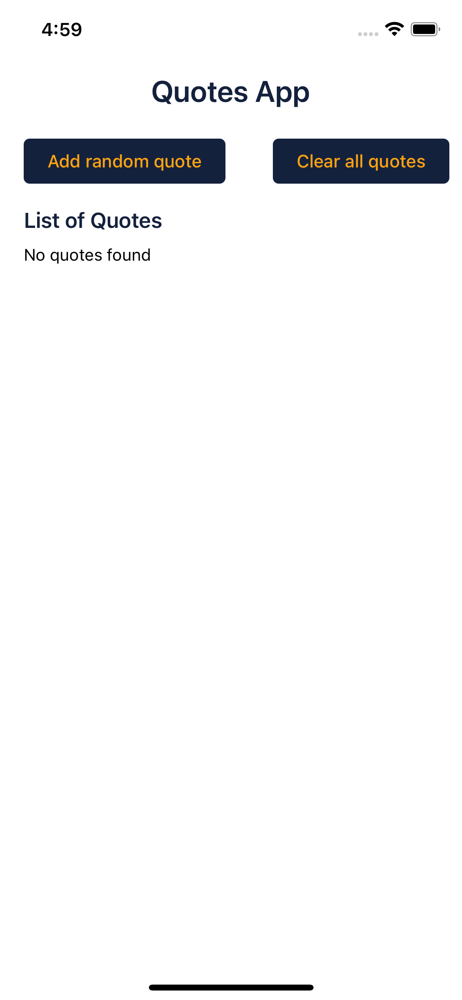

# QuoteApp

A React Native application to fetch and display random quotes using Redux Toolkit and Async Thunks.

---

## App Preview

| QuoteApp Lists                                | QuoteApp Empty Lists                                  |
|-----------------------------------------------|-------------------------------------------------------|
|  |       |


---

## Features

- Fetch random quotes from an API
- Display list of quotes
- Add new random quotes
- Clear all quotes from the list
- Delete quote from the list
- State management using Redux Toolkit and `createAsyncThunk`
- Error handling and loading states

---

## Tech Stack

- **React Native** (TypeScript)
- **Redux Toolkit** for state management
- **React Navigation** for screen navigation
- **CocoaPods** for iOS dependencies
- **Android Studio**, **Xcode** for native builds

---

## Getting Started

### Prerequisites

- Node.js (v14+ recommended)
- React Native CLI
- Android Studio with Android SDK
- Xcode (for iOS only)
- CocoaPods (for iOS dependencies)

### Installation

1. Clone the repository

```
git clone https://github.com/VaunshikaG/QuoteApp.git
cd QuoteApp
```

2. Install dependencies

```
npm install
# or
yarn install
```

3. Install iOS dependencies

```
cd ios
bundle install
bundle exec pod install
cd ..
```

> If you don't have bundler installed, install it with:
> ```
> gem install bundler
> ```

4. Start Metro bundler

```
npm start
# or
yarn start
```

5. Run the app

- For Android emulator:

```
npm run android
# or
yarn android
```

- For iOS simulator:

```
npm run ios
# or
yarn ios
```

---

## Usage

- The app starts with a Splash screen while loading user auth state.
- Navigate between Signup, Login, Home, Profile, Details, and AddToCart screens.
- On the Home screen, use buttons to fetch and add new quotes or clear the quote list.
- Quotes are stored and managed in Redux state.

---

## Folder Structure

```
/src
  /features          # Redux slices and store
  /screens           # Screen components
  /App.tsx           # Entry point
```

---

## Troubleshooting

- If you encounter CocoaPods errors, run `pod repo update` and `pod install` inside `ios/`.
- Clean build folders if needed:

```
cd ios && xcodebuild clean && cd ..
cd android && ./gradlew clean && cd ..
```

- For Android build issues, ensure your emulator/device and SDK are properly configured.

---

## Contributing

Contributions are welcome! Please open an issue or submit a pull request.

---

## License

MIT License

---

## Contact

For questions or support, contact the maintainer.

```

If you want, I can also prepare detailed setup and troubleshooting instructions or add sections about the API or authentication flow. Just let me know!

[1] https://github.com/VaunshikaG/QuoteApp